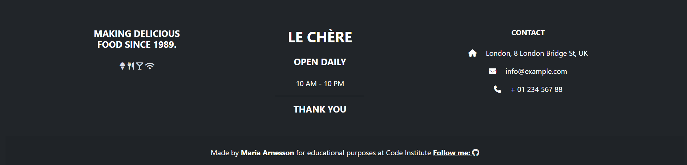

# Restaurant Le chère

[View the live project here](https://restaurantlechere.herokuapp.com)
Here is the reservation system for Le chère Restaurant created in Django for Portfolio Project 4 - Python + Django Essentials for Diploma in Full Stack Software Development at [Code Institute](https://codeinstitute.net/se/). 

The user has the ability to book one or more guests for a meal at the restaurant for a specific time and date, and has the ability to edit or delete reservations.
The website owner has the ability to accept online reservations for this restaurant.

Responsive

# Table of content

- [User Experience (UX)](#user-experience-ux)
    - [Site owner's goal](#site-owners-goal)
- [Features](#features)
    - [Existing Features](#existing-features)
    - [Features Left to Implement](#features-left-to-implement)
- [Design](#design)
    - [Wireframe](#wireframe)
    - [Colour Adobe](#colour-adobe)
- [Testing](#testing)
- [Typgraphy](##Typography)   
- [Deployment](#Deployment)
- [Technologies Used](#technologies-used)
    - [Languages Used](#languages-used)
    - [Frameworks, Libraries and Programs Used](#frameworks-libraries-and-programs-used)
- [Credits](#Credits)
    - [Content](##Content)
    - [Code](##Code)
    - [Media](##Media)
    - [Designe](##Designe)
    - [Testing.md example](#tesingmd-example)
- [Acknowledgements](#acknowledgements)    

# User Experience (UX)
## USER STORIES:
- USER STORY: Navigation bar #1
    - As a **Site User** I can **use navigation menu ** to **switch to other options.**
- USER STORY: Button Home #2
    - As a **Site User** I can **select the home option** to **find out more information about the restaurant**, like **restaurant story** and **satisfied customer reviews.**
- USER STORY: Online Booking Button #3
    - As a **Site User** I can **select the online booking option** to **make table reservations.**
- USER STORY: My Bookings Button #4
    - As a **Site User** I can **select my bookings option** to check **my booking history**
- USER STORY: Log in / Log out Button #5
    - As a **Site User** I can **select the option log in/ log out** to be able **to log in or out of the site.**
- USER STORY: Our Menu #6
    - As a **Site User** I can **use the our menu option** to check **the current menu.**
- USER STORY: Admin account #7
    - As a **Admin** I can **access to all table reservations**
- USER STORY: Edit reservation #8
    - As a **logged in Site User** I can **edit/delete existing bookings** so that **I can make changes online if needed.**
- USER STORY: Account registration #9
    - As a **Site User** I can **register an account**
- USER STORY: Log in #10
    - As a **Site User** I can **register or log in** to **make table reservations**
- USER STORY: Registration #11
    - As a **Site User** I can **register** by **entering my email, password** and **confirming my password.**
- USER STORY: Password #12
    - As a **Site User** I can **easily recover my password** in case **I forget it.**     
- USER STORY: Footer layout #13
    - As a **Site User** I can **use the footer** to switch to **other options** and check **restaurant locations on the map.**
- USER STORY: Basic information on the homepage. #14
    - As a **Site User** I can **use information from the home page** so that **I will get basic information.**
- USER STORY: Lower priced meal suggestions are available on the home page. #15
    - As a **Site User** I would like to have **access to the lower priced meals shown on the home page** so that **I can take advantage of the promotion.**
- USER STORY: Icons showing customer and meal information. #16
    - As a **Site User** I am aware of the **number of guests** and **the number of meals in the restaurant** so that **I know if the restaurant has good reviews.**
- USER STORY: Chef information and photo. #17
    - As a **Site User** I want **access to information about the chef** so that **I can find out more about the restaurant.**            
- USER STORY: Video for the table booking page. #18
    - As a **Site User** I can **see the video of the table** so that **I can see the structure of the tables in the restaurant.**    
- USER STORY: Create booking #19
    - As a **Site User** I can **choose the online booking option** to **reserve a table**
- USER STORY: Check reservations #20
    - As a **Site User** I can **select my bookings option** to check **my bookings history.**

# Features
## Existing Features
- Navigation bar
    - The navigation bar is easy to read and looks pleasent. The full responsive navigation bar includes links the Logo, Home page, Online booking, Our Menu and it is possible to log in and check the booking's history. The navigation bar is identical in each page to allow for easy navigation.
    The navigation bar is responsive on the iPod screen, the sites in the navigation bar on smallare screen are covered to the 'burger' style. 
    

    

    When a user is not logged in, it is possible to register or log in:

    
    
    The logged in user has the ability to make a reservation and check the reservations in the booking history, and the ability to log out:

    

    The navigation bar will allow the user to easily navigate from page to page on all devices without returning to the previous page using the "Back" button.

- Home Page
    - After the page loads, a picture of a women with a cup is shown as the main picture that introduces the text about the restaurant.    

    

- Introduction text
    - Scrolling down a few words from the author is introducing and setting out what the website is presenting and the general information about the restaurant is being told.

- Home Page Photos of foods
    - The next part of the main page shows four photos of food nicely arranged  one above the other. The photos present meals served in the restaurant.

   

- Home Page Introduction Text

    

- Home Page - short description about the restaurant

    

Home Page - about a chef to the restaurant

- Footer
    - The footer includes restaurant's location, address and opening hours are presented.

    - The background of the footer is slightly darker to show the contrast between the text in a distinctive way.

    

- Menu
    - The menu page gives a list of meals served in the restaurant. There is described the meals, drinks and the price of them.

    - Menu- main dishes
     

    - Menu- drinks
    

    - Menu- desserts
     

- Booking Online Page
    - The user has to be logged in to reserve a table. There is a possibility to book a table on the online booking website. The user selects the date/time of the reservation from the drop-down list and can select the number of guests from 1 to 5 to indicate how many people they want to include in their booking, and select a occassion from existing in the form. The user then clicks the Add reservation button to complete the booking and is redirected to the My Bookings page to see all upcoming and past bookings.

    - Booking Online Page:
    
    - Booking Online Page on smaller screens:
    

- My Bookings Page
    - Edit/Remove booking.

    
- Messages 
    
    

    

- Log in / Log out
    -

    
    
    

## Features which could be implemented in the future:
- video supporting the facts:
    - By adding a video about the restaurant, the user could learn more about restaurant and localisation.
- video as a background to the online booking page.
# Design
## Wireframe: 
- Wireframe Desktop:
    - Home Page
    

    - Menu
    

    - Booking Online Page
    

    - My Bookings Page
    

- Wireframe on smaller screen
    - Home Page
    

    - Menu
    

    - Booking Online Page
    

## Colour Adobe

The background color is chosen in a light color to make the contrast between text, photos and background clearly visible.

## Typography

- Google Fonts were used to import Caveat, Courier and Sans fonts into styles.css. They were chosen because "Caveat" goes well with the quote and "Courier New" and "Sans" go well together and match the text on the history page.

# Testing 

Testing information can be found in separate [testing.md](testing.md) file. 

# Deployment:
- The site was deployed to GitHub pages. The steps to deploy are as follows:
    - 

+# Technologies Used
## Languages Used
- [HTML](https://sv.wikipedia.org/wiki/HTML)
- [CSS](https://en.wikipedia.org/wiki/CSS)
- [PYTHON]
-

## Frameworks, Libraries and Programs Used:

- [Balsamiq](https://balsamiq.com/) was used to create wireframes.
- [Font Awesome](https://fontawesome.com/) was used to create icons to footer.
- [Google Fonts](https://fonts.google.com/?preview.text=Love%20Running&preview.text_type=custom) was used to import 'Caveat', 'Courier New' och 'Sans' that have been used for each page.
- [Git](https://git-scm.com/) was used  by utilising the Gitpod terminal to commit to Git and Push to GitHub.
- [GitHub](https://github.com/) was used as a repository for code of the project. 

# Credits

## Content:
- 
## Code:
- 

## Media:
- 
  
   
## Designe
- 

## Credits

- (https://getbootstrap.com/)
- (https://www.djangoproject.com/)
- (https://tobiasahlin.com/moving-letters/#16)