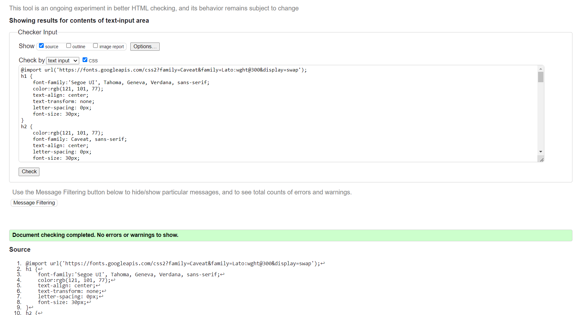
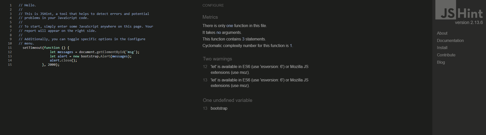

# Restaurant Le chère- Testing details

[Main README.md file](README.md)

[View the live project here](https://restaurantlechere.herokuapp.com)

## Table of content

## Automated Testing
### Validation:

- W3C Markup Validation HTML
- W3C CSS validation CSS
    - [Validator.w3](https://validator.w3.org/nu/#textarea)  was used to validate CSS.
    
- JSHint JavaScript
    - [JSHint](https://jshint.com/) was used to validatw JS.
    

- Python
    - [Python visual studio](https://marketplace.visualstudio.com/items?itemName=ms-python.python) was used to validate Python code. 

Python Testing 
- Testing for python code was run in the test.py file. 

## Manual Testing 
### User Stories Testing

1. USER STORY: Navigation bar #1
    - As a **Site User** I can **use navigation menu ** to **switch to other options.**

     The layout of the restaurant Le chère navigation bar is built in the following way:
    - The navigation bar is located at the top of the page.
    - The logo is on the left side.
    

2. USER STORY: Button Home #2
    - As a **Site User** I can **select the home option** to **find out more information about the restaurant**, like **restaurant story** and **satisfied customer reviews.**

    Acceptance Criteria:
    - The home option must be available on each page of the webbsite in the navigation bar.

    By selecting the home option, the user has access to the main page showing photos of products that are on sale (by selecting the "see our menu" option, it is possible to go to our menu page) as well as a description of the history of the restaurant, a few words about the restaurant's chef.

    The layout of the restaurant Le chère Home Page is built in the following way:

    - After loading the page, a picture of a woman holding a mug appears.
    - Scrolling down, there are privoded 4 pictures of products that are currently discounted.
    - Scrolling down, there are provided information about the number of satisfed guests, lunches every day, family tables, team members.
    - Scrolling down, there are provided see two pictures of the dishes and a description of the history of the restaurant,
    - Scrolling down, there is provided a photo of the woman who is the chef of the restaurant and a short introduction.

- USER STORY: My Bookings Button #4
    - As a **Site User** I can **select my bookings option** to check **my booking history**

    Acceptance Criteria:
    - The home option must be available on each page of your site in the navigation bar

    Using the navigation bar, it is possible to use the option: "Online Booking". This site gives us the opportunity to book a table directly on the website, in a very simple way, using a form.

    The layout of the restaurant Le chère Online Booking Page is built in the following way:

    - while filling out the form, it is necessary to indicate the number of guests, date and time of booking, occassion and special request.
    - by selecting the "add reservation" option, the user sends the data further, and the can check the booking history on the page: my bookings.

- USER STORY: Log in / Log out Button #5
    - As a **Site User** I can **select the option log in/ log out** to be able **to log in or out of the site.**

    The layout of the restaurant Le chère Log in/log out Page is built in the following way:
    - On the sign up page, the user is required to provide the contact phrase so that later can easily log in to the login page using the username and password.

- USER STORY: Our Menu #6
    - As a **Site User** I can **use the our menu option** to check **the current menu.**
    The layout of the restaurant Le chère Menu Page is built in the following way:
    - The menu is divided into three parts: main dishes, drinks and desserts. Each of them presents a description of the dishes served in the restaurant and the price.

- USER STORY: Admin account #7
    - As a **Admin** I can **access to all table reservations**
    The layout of the restaurant Le chère Admin account is built in the following way:
    Logged in via admin account it is possible to access all booked tables. Editing and canceling reservations is possible. Entering the number of guests is also possible.

- USER STORY: Edit reservation #8
    - As a **logged in Site User** I can **edit/delete existing bookings** so that **I can make changes online if needed.**
    The layout of the restaurant Le chère My bookings is built in the following way:
    There is the user's bookings history.
    In My Bookings Page user has the ability to edit/delete reservations.

- USER STORY: Account registration #9
    - As a **Site User** I can **register an account**
     The layout of the restaurant Le chère Log in/log out Page is built in the following way:
    - On the sign up page, the user is required to provide the contact phrase so that later can easily log in to the login page using the username and password.

- USER STORY: Log in #10
    - As a **Site User** I can **register or log in** to **make table reservations**
    Wanting to make a reservation without being logged in, a message is displayed that the user must first log in.

- USER STORY: Registration #11
    - As a **Site User** I can **register** by **entering my email, password** and **confirming my password.**
    User registration is possible in a very simple way, by filling in the form with an e-mail address and entering a password.  
- USER STORY: Footer layout #13
    - As a **Site User** I can **use the footer** to check **contact details and opening hours.**
    The layout of footer to the restaurant Le chère is built in the following way:
    The footer contains opening hours, contact details such as location, email address and restaurant phone number.
    In this way, the user can easily and quickly contact the restaurant.

- USER STORY: Basic information on the homepage. #14
    - As a **Site User** I can **use information from the home page** so that **I will get basic information.**
        - The layout of home page is built in the following way:
            The entire home page is designed to provide the user with basic information about the restaurant in a very clear and understandable way. There are a few photos so that the user can visually imagine the interior of the restaurant and the dishes served there, and the text is quite short, but it contains a lot of basic and most important information for the customer.
- USER STORY: Lower priced meal suggestions are available on the home page. #15
    - As a **Site User** I would like to have **access to the lower priced meals shown on the home page** so that **I can take advantage of the promotion.**
        - The layout Lower priced meal is built in the following way:
            4 photos of meals with a lower price than usual. By clicking on the 'see our menu' button, the menu page is displayed.
            The purpose of the featured meals that are on promotion on the home page is to encourage the user to consider ordering them. The idea is to update the pictures every week to get more customers.
- USER STORY: Icons showing customer and meal information. #16
    - As a **Site User** I am aware of the **number of guests** and **the number of meals in the restaurant** so that **I know if the restaurant has good reviews.**
        - The layout of icons on home page is built in the following way:
        4 icons representing: 1550 satisfied guests, 125 launches every day, 35 family tables, 18 team members.
- USER STORY: Chef information and photo. #17
    - As a **Site User** I want **access to information about the chef** so that **I can find out more about the restaurant.** 
        - The layout of information about chef to the restaurant on home page is built in the following way:
        There is presented a photo of the chef, a short description, and a signature.      
- USER STORY: Video for the table booking page. #18
    - As a **Site User** I can **see the video of the table** so that **I can see the structure of the tables in the restaurant.**    
        - The layout of video for the table booking page is built in the following way:
        This page shows the interior and table layout of the restaurant, and basic information on how the user can reserve a table.
- USER STORY: Create booking #19
    - As a **Site User** I can **choose the online booking option** to **reserve a table**
        - The layout of online booking page is built in the following way:
        The Online Booking page presents a form so that the user can easily book a table, the form includes the number of guests, date and time of booking, occasion and special request.

- USER STORY: Check reservations #20
    - As a **Site User** I can **select my bookings option** to check **my bookings history.**
        - The layout of the restaurant Le chère Online Booking Page is built in the following way:

         - while filling out the form, it is necessary to indicate the number of guests, date and time of booking, occassion and special request.
        - by selecting the "add reservation" option, the user sends the data further, and the can check the booking history on the page: my bookings.

### Testing on desktop
All steps are performed in browsers:
 - Chrome - Version 111.0.5563.65 (Officiell version) (64 bitar)
 - Microsoft Edge - Version 111.0.1661.44 (Officiell version) (64 bitar)
 - Firefox - 111.0 (64-bitars)

#### This has been verified on every page:
- Navigation bar:
    - Hover over each link has been made. The effect has been confirmed to be correct.
    - The Home page link has been pressed and confirmed to take the user to the Home page.
    - The Our Menu page link has been pressed and confirmed to take the user to the Our Menu page.
    - The Online Booking page link has been pressed and confirmed to take the user to the Online Booking page.
    - The My bookings page link has been pressed and confirmed to take the user to the My bookings page.
    - The Sign Up and Log in/ Log out page link has been pressed and confirmed to take the user to the responsive page.

- Footer:
    - It has been verified that the footer is displayed as expected.

#### Home Page

1. Home Page Images
    - It has been confirmed that the main image on the site is clear and shows up after the page loads.
    - All pictures on the home page have been reviewed and verified to be the correct size.    

2. Home Page Text
    - It has been confirmed that the title and text are correct and display correctly.

#### Our Menu Page

1. Menu
     - It has been confirmed that the menu text is correct, in the right place and display correctly. 

2. Our Menu Page Images
    - It has been confirmed that all pictures on the site is clear and shows up after the page loads and have been reviewed and verified to be the correct size and on correct place.

#### Online Booking Page

1. Online Booking Page Image next to the form
    - It has been confirmed that the main image on the site is clear and shows up after the page loads.

2. Online Booking Page Text
    - It has been confirmed that the title and text are correct and display correctly and on correctly place.

3. Online Booking Page Form
    - It has been confirmed that the online booking page form is laid out as expected.
    - It has been confirmed that if a user submits a form without filling out the required fields, a message is shown to complete them.
    - It has been confirmed that it shows a message with a valid date if the user enters a name other the date in the date input field. 
    - it has been confirmed that after completing the form correctly and pressing submit, the user will go to the my bookings page.

#### My bookings Page

1. My bookings Page Text
    - It has been confirmed that the title and text are correct and display correctly and on correctly place.
    - The data that was entered into the form on the Online Booking page has been transferred to and displayed in the booking details on the my bookings page.

#### Log in

1. Log in Page Image next to the form
    - It has been confirmed that the main image on the site is clear and shows up after the page loads.

2. Log in Page Text
    - It has been confirmed that the title and text are correct and display correctly and on correctly place.

3. Log in Page Form
    - It has been confirmed that the online booking page form is laid out as expected.
    - It has been confirmed that if a user submits a form without filling out the required fields, a message is shown to complete them.
     - It has been confirmed that it shows a message with a valid username if the user enters a name other the username in the username input field.
     - It has been confirmed that it shows a message with a valid password if the user enters a name other the password in the password input field.
    - it has been confirmed that after completing the form correctly and pressing submit, the user will go to the home page.

#### Sign Up

1. Sign Up Page Image next to the form
    - It has been confirmed that the main image on the site is clear and shows up after the page loads.

2. Log in Page Text
    - It has been confirmed that the title and text are correct and display correctly and on correctly place.

3. Log in Page Form
    - It has been confirmed that the online booking page form is laid out as expected.
    - It has been confirmed that if a user submits a form without filling out the required fields, a message is shown to complete them.
     - It has been confirmed that it shows a message with a valid e-mail address if the user enters a name other the e-mail address in the e-mail input field.
     - Confirmed to display a message with the correct password if the user enters a different password than the first time, or if the password does not match the required arrangement.
    - it has been confirmed that after completing the form correctly and pressing submit, the user will go to the home page.

#### Log out Page

1. Log out Page Text
    - It has been confirmed that the title and text are correct and display correctly and on correctly place.
    - The button works properly, and after pressing log out button, the user is logged out.

#### Edit Booking Page

1. Edit Booking Page Image next to the form
    - It has been confirmed that the main image on the site is clear and shows up after the page loads.

2. Edit Booking Page Text
    - It has been confirmed that the title and text are correct and display correctly and on correctly place.

3. Edit Booking Page Form
    - It has been confirmed that the edit booking page form is laid out as expected.
    - It has been confirmed that if a user submits a form without filling out the required fields, a message is shown to complete them.
    - It has been confirmed that it shows a message with a valid date if the user enters a name other the date in the date input field. 
    - it has been confirmed that after completing the form correctly and pressing submit, the user will go to the my bookings page.

#### Delete Booking Page

1. Delete Booking Page Text
    - It has been confirmed that the title and text are correct and display correctly and on correctly place.
    - The button works properly, and after pressing delete booking button, the user is logged out.
